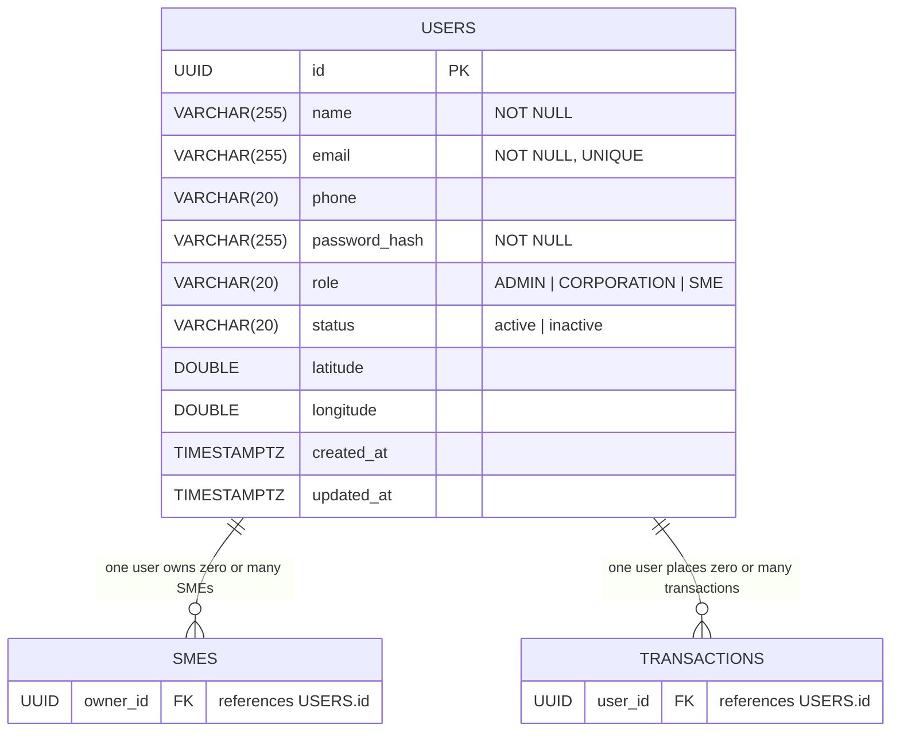

# ERD — Auth Service

## Cardinality legend
| Notation | Meaning |
|----------|---------|
| `\|\|`  | exactly one |
| `o\|`   | zero or one |
| `\|{`   | one or more |
| `o{`    | zero or more |

## Notes
- Single source of truth for user identity across all services.
- Issues JWT tokens; downstream services verify the token independently.
- `role` drives authorization: `CORPORATION` creates transactions, `SME` registers business profiles, `ADMIN` has full access.
- `latitude` / `longitude` store the user's location, used by nearby-service to find SMEs near the requester.
- Every `smes.owner_id` and `transactions.user_id` is a cross-service FK back to `USERS.id`.
