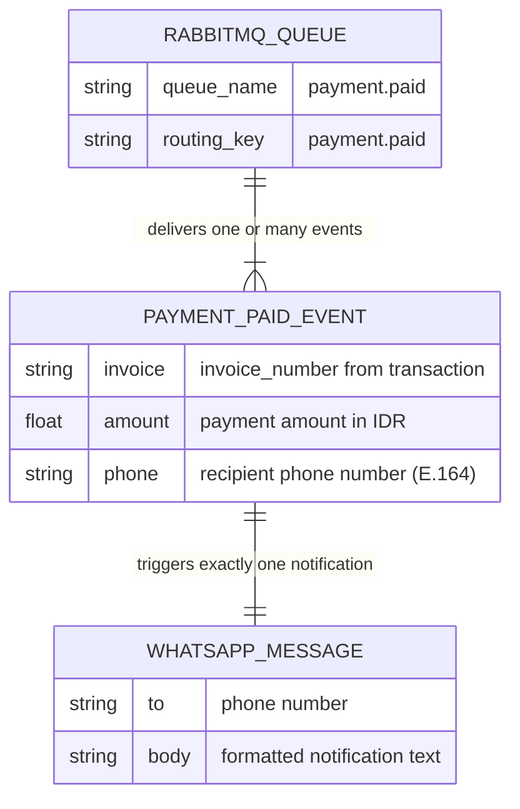

# ERD — Communication Service



## Cardinality rationale
| Relationship | Left | Right | Reason |
|---|---|---|---|
| RABBITMQ_QUEUE → PAYMENT_PAID_EVENT | exactly one | one or many | The queue always has at least one message in flight when the worker is processing; it accumulates many events over time |
| PAYMENT_PAID_EVENT → WHATSAPP_MESSAGE | exactly one | exactly one | Every consumed event results in exactly one WhatsApp notification call |

## Notes
- This service owns **no database table**; it is a pure event consumer.
- Subscribes to the `payment.paid` queue on RabbitMQ (AMQP) with manual ack/nack.
- WhatsApp message format:
  ```
  Pembayaran berhasil diterima.
  Invoice: INV-20240526-001
  Nominal: Rp1.000.000
  Terima kasih.
  ```
- When `RABBITMQ_URL` is empty the worker logs a warning and blocks (graceful fallback for local dev).
- Graceful shutdown via `signal.NotifyContext` (SIGINT / SIGTERM).
