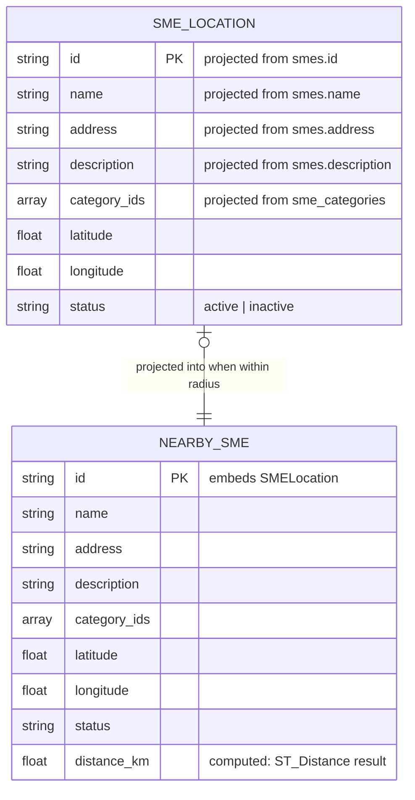

# ERD — Nearby Service

## Cardinality rationale
| Relationship | Left | Right | Reason |
|---|---|---|---|
| SME_LOCATION → NEARBY_SME | zero or one | exactly one | An SME location either falls within the search radius (produces one result row) or does not (produces none). Each result always traces back to exactly one source location. |

## Notes
- This service owns **no persistent table**; it queries the `smes` table (sme-service) via PostGIS `ST_DWithin`.
- `SMELocation` and `NearbySME` are **read-only projections** (in-memory structs), not separate DB tables.
- `distance_km` is a computed field derived from `ST_Distance(location, user_point)`.
- Input: user latitude/longitude + optional `radius_km` and `category_id` query parameters.
- Output: ranked list of `NearbySME` sorted by `distance_km` ascending.
