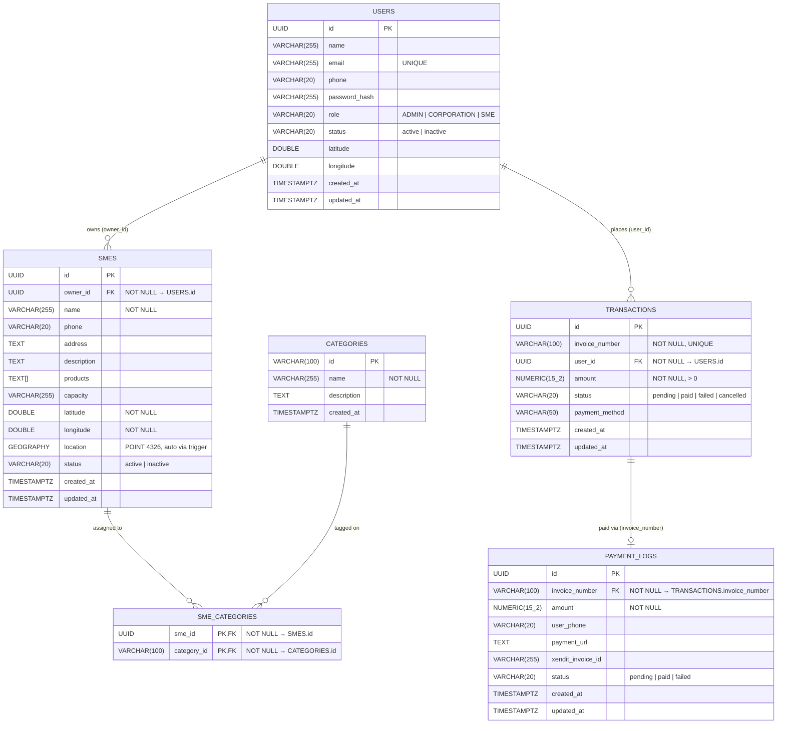

# ERD — Cross-Service Overview

All persistent tables and their relationships across service boundaries.

## Cardinality reference

| Relationship | Notation | Left side | Right side |
|---|---|---|---|
| USERS → SMES | `\|\|--o{` | exactly one user | zero or many SMEs |
| USERS → TRANSACTIONS | `\|\|--o{` | exactly one user | zero or many transactions |
| SMES → SME_CATEGORIES | `\|\|--o{` | exactly one SME | zero or many category rows |
| CATEGORIES → SME_CATEGORIES | `\|\|--o{` | exactly one category | zero or many SME rows |
| TRANSACTIONS → PAYMENT_LOGS | `\|\|--o\|` | exactly one transaction | zero or one payment log |

## Service ownership

| Table | Owner Service | Consumers |
|---|---|---|
| `users` | auth-service | user-service (read), nearby-service |
| `categories` | sme-service | nearby-service (read) |
| `smes` | sme-service | nearby-service (PostGIS read) |
| `sme_categories` | sme-service | nearby-service (read) |
| `transactions` | transaction-service | report-service (read), payment-service |
| `payment_logs` | payment-service | — |

## Services with no persistent table

| Service | Role |
|---|---|
| api-gateway | HTTP reverse proxy + JWT validation |
| nearby-service | PostGIS read queries on `smes`, returns `NearbySME` projections |
| user-service | Read-only projection of `users` |
| report-service | Read-only projection of `transactions` |
| communication-service | RabbitMQ consumer, calls WhatsApp API |
