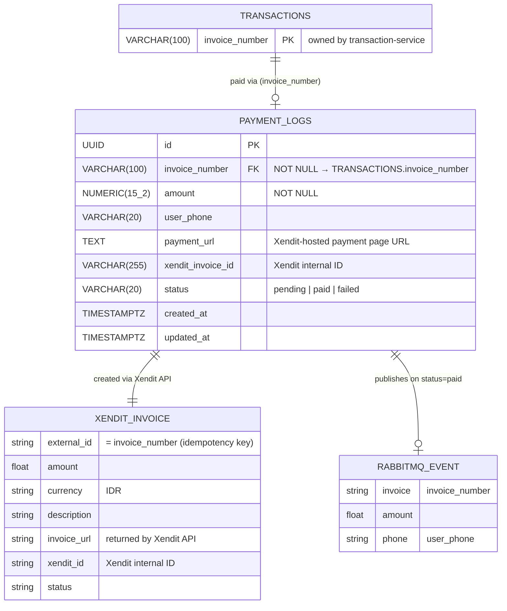

# ERD — Payment Service

## Cardinality rationale
| Relationship | Left | Right | Reason |
|---|---|---|---|
| TRANSACTIONS → PAYMENT_LOGS | exactly one | zero or one | A transaction has no payment log until `create-va` is called; at most one log per transaction |
| PAYMENT_LOGS → XENDIT_INVOICE | exactly one | exactly one | Creating a payment log always involves one Xendit API call (real or mock) |
| PAYMENT_LOGS → RABBITMQ_EVENT | exactly one | zero or one | Only `paid` webhooks publish an event; `pending`/`failed` logs never emit one |

## Notes
- `XENDIT_INVOICE` and `RABBITMQ_EVENT` are **not DB tables** — they represent the Xendit API payload and the RabbitMQ message body.
- `invoice_number` is a cross-service FK to `transactions.invoice_number` (transaction-service), enforced in the DB migration.
- When `XENDIT_SECRET_KEY` env var is empty the client runs in **mock mode** (returns a fake invoice URL).
