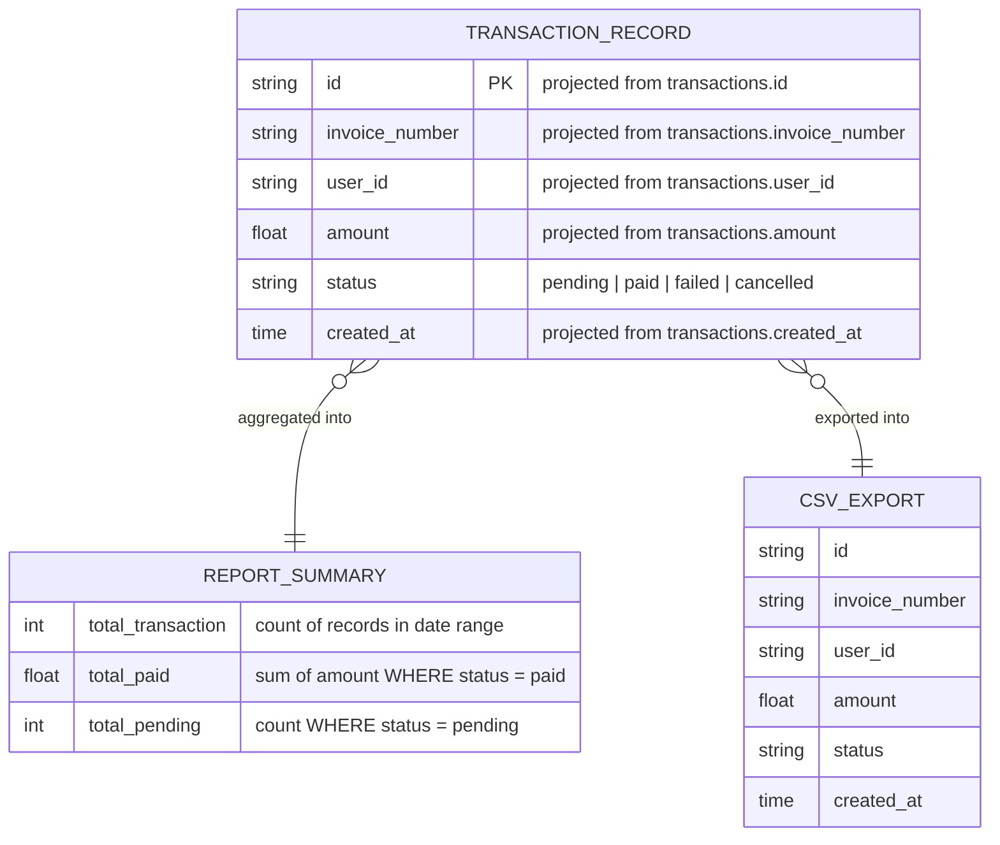

# ERD — Report Service

## Cardinality rationale
| Relationship | Left | Right | Reason |
|---|---|---|---|
| TRANSACTION_RECORD → REPORT_SUMMARY | zero or many | exactly one | A date range may have no transactions (empty summary); all records in range collapse into one summary object |
| TRANSACTION_RECORD → CSV_EXPORT | zero or many | exactly one | A date range may export zero rows; all rows in range serialize into one CSV file |

## Notes
- This service owns **no persistent table**; it reads from the `transactions` table (transaction-service).
- `TransactionRecord`, `ReportSummary`, and `CSV_EXPORT` are **in-memory projections**, not DB tables.
- Three report endpoints:
  - `GET /api/v1/reports/daily?date=YYYY-MM-DD` — summary for a single day.
  - `GET /api/v1/reports/monthly?year=YYYY&month=MM` — summary for a full month.
  - `GET /api/v1/reports/export?from=YYYY-MM-DD&to=YYYY-MM-DD` — CSV download (`Content-Disposition: attachment`).
