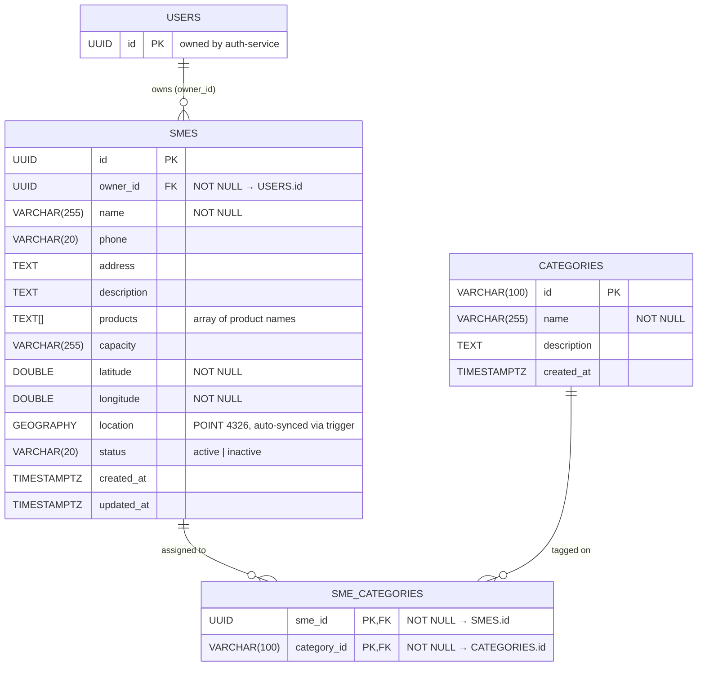

# ERD — SME Service

## Cardinality rationale
| Relationship | Left | Right | Reason |
|---|---|---|---|
| USERS → SMES | exactly one | zero or many | A user may own no SME yet; they can register multiple |
| SMES → SME_CATEGORIES | exactly one | zero or many | Category tags are optional at creation time |
| CATEGORIES → SME_CATEGORIES | exactly one | zero or many | A category may exist before any SME is tagged with it |

## Notes
- `owner_id` is a cross-service FK to `users.id` (auth-service), enforced in the DB migration.
- `location` (PostGIS GEOGRAPHY) is auto-populated from `latitude`/`longitude` via the `trg_sme_location` trigger on INSERT/UPDATE.
- `products` is a PostgreSQL text array; each element is a product/service name offered by the SME.
- GIST index on `location` enables fast `ST_DWithin` queries used by nearby-service.
