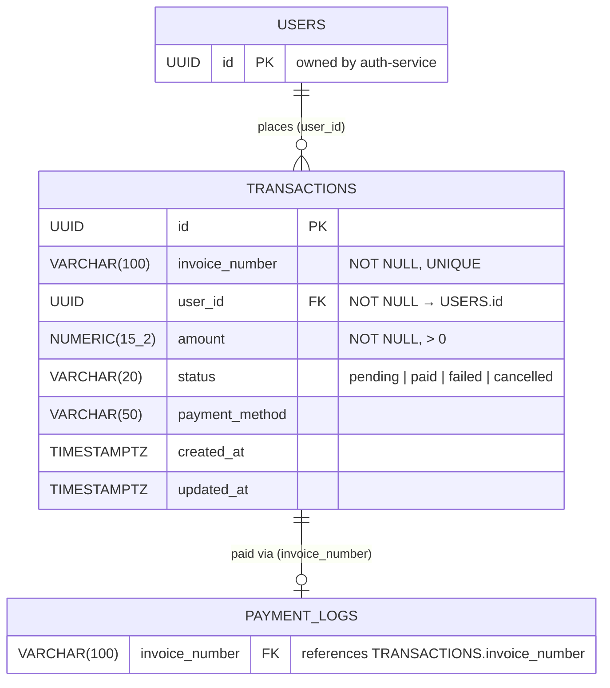

# ERD — Transaction Service

## Cardinality rationale
| Relationship | Left | Right | Reason |
|---|---|---|---|
| USERS → TRANSACTIONS | exactly one | zero or many | A user may have no transactions yet; they can create many |
| TRANSACTIONS → PAYMENT_LOGS | exactly one | zero or one | A transaction has no payment log until `create-va` is called; at most one VA is created per transaction |

## Notes
- `user_id` is a cross-service FK to `users.id` (auth-service), enforced in the DB migration.
- `invoice_number` format: `INV-YYYYMMDD-<seq>` (e.g. `INV-20240526-001`), generated by an atomic counter in the usecase layer.
- Status lifecycle: `pending` → `paid` (via payment webhook) or `failed` / `cancelled`.
- Indexes on `user_id`, `status`, `created_at`, and `invoice_number` for efficient filtering and reporting.
