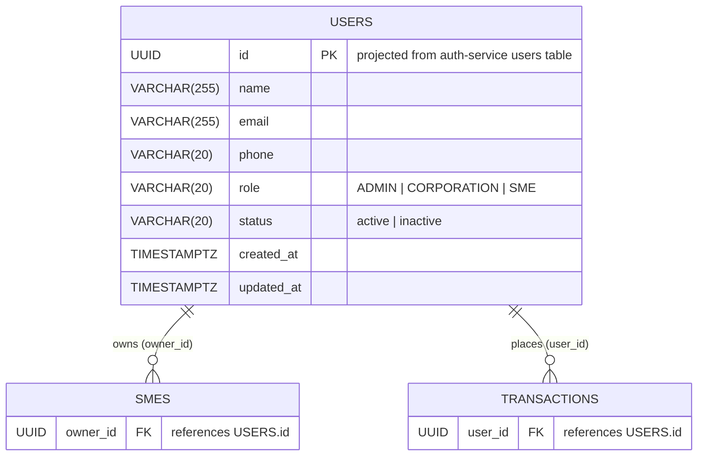

# ERD — User Service

## Cardinality rationale
| Relationship | Left | Right | Reason |
|---|---|---|---|
| USERS → SMES | exactly one | zero or many | A user may own no SME yet; a user with role SME can register multiple business profiles |
| USERS → TRANSACTIONS | exactly one | zero or many | A user may have no transactions yet; they can accumulate many over time |

## Notes
- This service is a **read-only view** over the `users` table owned by auth-service.
- It does not write to any table; mutations (register, login) go through auth-service.
- `password_hash` is **never returned** by this service.
- gRPC interface defined in `proto/user/user.proto` (`GetUser`, `ListUsers`).
